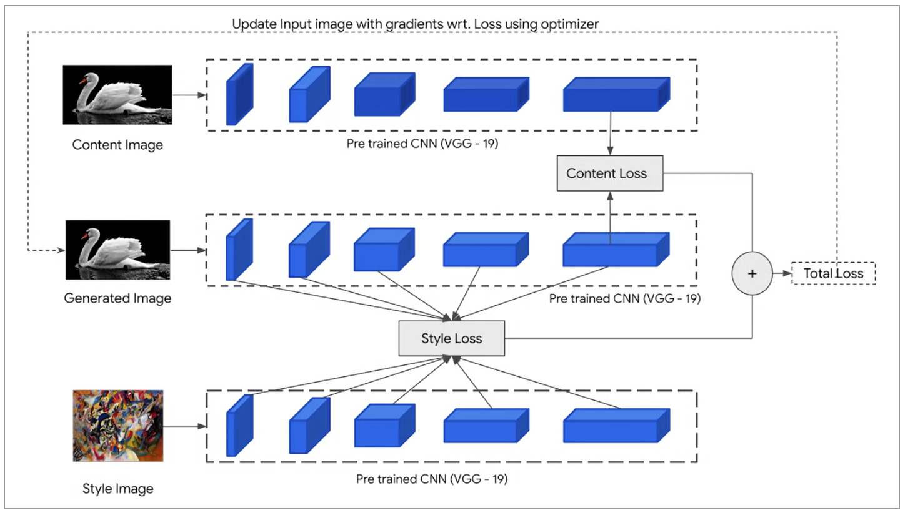
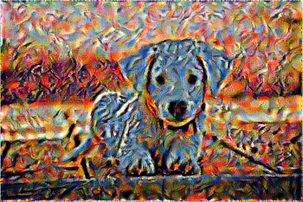

# Neural Style Transfer with TensorFlow

This project demonstrates **Neural Style Transfer (NST)**, a technique to blend the artistic style of one image with the content of another image using a pre-trained **VGG19** model as the feature extractor.

---


## Features

- Utilizes a **VGG19** model to extract style and content features from images.
- Combines content from one image with the artistic style of another to produce a stylized output image.
- Scales input images for optimal performance and visual quality.
- Supports saving and visualizing generated outputs.
- Includes utility functions for loading, preprocessing, and displaying images.

---

## Installation

1. Clone the repository:
   ```bash
   git clone https://github.com/ahmad786writes/Neural-Style-Transfer-with-TensorFlow
   cd Neural-Style-Transfer-with-TensorFlow
   ```

2. Install the required dependencies:
   ```bash
   pip install tensorflow
   ```
---

## Usage

### 1. Prepare Input Images
Ensure you have the content and style images available in your working directory.

### 2. Run the Notebook
Open the Jupyter Notebook and follow the step-by-step instructions:
   ```bash
   jupyter notebook Neural\ Style\ Transfer.ipynb
   ```

### 3. Select Content and Style Layers
Choose intermediate layers of the VGG19 network to compute style and content losses:
- **Style Layers**: Use the first layer of each convolutional block.
- **Content Layer**: Use a single deeper convolutional layer.

---

## Key Components

### Utility Functions
- `load_img(path_to_img)`: Loads and scales input images to 512 pixels.
- `tensor_to_image(tensor)`: Converts a tensor into a human-readable image format.

### Model Architecture
- **VGG19 Pre-trained Model**: Used to extract content and style features from input images.
- **Loss Functions**:
  - **Content Loss**: Ensures the output retains content features from the content image.
  - **Style Loss**: Matches the Gram matrix of style features between the style image and output image.

### Outputs
The final output is a generated image that blends the content of the content image with the artistic style of the style image.

---

## Results
Upload your own content and style images to create unique artwork! Below is an example of generated results:

| **Content Image** | **Style Image** | **Output Image** |
|--------------------|-----------------|------------------|
|  |  |  |

---

## Acknowledgments
- The project uses the [TensorFlow](https://www.tensorflow.org/) framework.
- The pre-trained VGG19 model is sourced from [Keras Applications](https://keras.io/api/applications/).

---

## License
This project is licensed under the MIT License.
